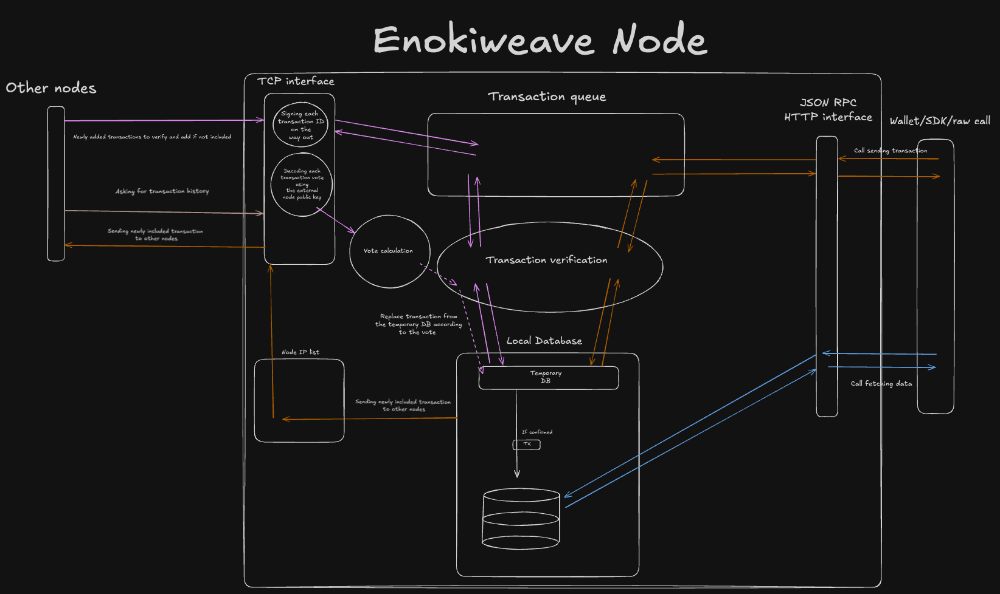

# Enokiweave

Enokiweave is a block-lattice cryptocurrency designed for sub-second transactions with zero fees. Built to deliver value transfer without compromising on speed or cost.

## Key Features

- **Zero Fees**: All transactions are completely free
- **Sub-second Finality**: Transactions confirm in milliseconds
- **Block-lattice Architecture**: Individual account chains enable parallel processing and swift finality
- **Minimal Resource Usage**: Efficient consensus mechanism keeps network operation lean and sustainable

## How It Works

Enokiweave uses a block-lattice structure where each account operates its own blockchain. This allows for:

- Immediate transaction processing without global consensus bottlenecks
- Parallel validation of transactions across different account chains
- No mining or transaction fees
- Ultra-low latency finalization

## High-level architecture


## Getting Started

# Clone the repository
```bash
git clone https://github.com/enokiweave/enokiweave
```

# Run the node
```bash
make run
```

# Send a transaction
```bash
echo '{"jsonrpc":"2.0","method":"submitTransaction","params":[{"from":[1,1,1,1,1,1,1,1,1,1,1,1,1,1,1,1,1,1,1,1,1,1,1,1,1,1,1,1,1,1,1,1], "signature": [1,1,1,1,1,1,1,1,1,1,1,1,1,1,1,1,1,1,1,1,1,1,1,1,1,1,1,1,1,1,1,1],"to":[1,1,1,1,1,1,1,1,1,1,1,1,1,1,1,1,1,1,1,1,1,1,1,1,1,1,1,1,1,1,1,1],"amount":100,"public_key":[1,1,1,1,1,1,1,1,1,1,1,1,1,1,1,1,1,1,1,1,1,1,1,1,1,1,1,1,1,1,1,1]}],"id":1}' | nc localhost 3000
```
